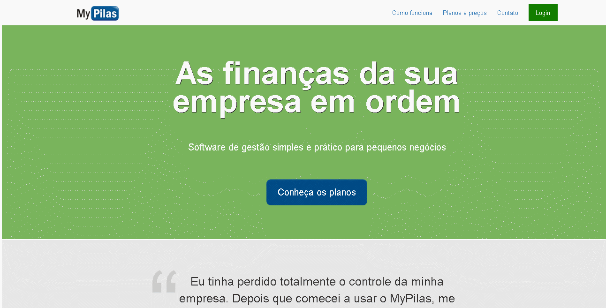

<h2 align="center">
  
  <p style="margin:20px" >Projeto MyPilas</p>
</h2>

<h1>
  
</h1>

<h1>
  
</h1>

<h2>🧾 Sobre</h2>
<p> Projeto simples de estudo sobre Web Design Responsivo com HTML5, CSS3 e BEM, e a implementação de um formulário, futuramente será integrada a uma api.</p>

<h2>🔧 Ferramentas</h2>
<ul>
    <li>
    <a href="https://developer.mozilla.org/pt-BR/docs/Web/HTML"> HTML5</a>
    </li>
    <li>
    <a href="https://developer.mozilla.org/pt-BR/docs/Web/CSS">CSS3</a>
    </li>
    <li>
    <a href="https://getbootstrap.com/">Bootstrap</a>
    </li>
    <li>
    <a href="https://developer.mozilla.org/pt-BR/docs/Web/JavaScript">JavaScript</a>
    </li>
    <li>
    <a href="http://getbem.com/"> Metodologia BEM </a>
    </li>        
</ul>

<h2>👨‍💻 Como configurar</h2>

```bash
  # Clone o projeto
  $ git clone https://github.com/joaovitor-cbc/projeto-mypilas.git
```

<p>Você pode pegar todos os arquivos deste site e executá-los apenas no seu computador como se estivessem online, apenas na sua máquina.</a>

<h2>📝 Licença</h2>
<p> Este projeto está sob a licença do MIT. Veja o arquivo<a href="https://github.com/joaovitor-cbc/projeto-mypilas/blob/main/LICENSE"> LICENCE </a>para maiores detalhes.</p>

<p align="center">Feito por<a href="https://www.linkedin.com/in/joão-vitor-araujo"> João Vitor</a></p>


